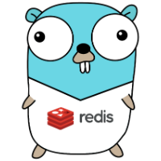

# Redis Template

<!--suppress ALL -->


[](https://github.com/GabrielHCataldo/go-redis-template/releases/tag/v1.0.0)
[](https://goreportcard.com/report/github.com/GabrielHCataldo/go-redis-template)
[](https://coveralls.io/github/GabrielHCataldo/go-mongo?branch=main)
[](https://www.codetriage.com/gabrielhcataldo/go-mongo)
[](https://redis.io/commands/)
[](https://github.com/redis/go-redis)
[](https://pkg.go.dev/github.com/GabrielHCataldo/go-redis-template/redis)


[//]: # ([![build workflow]&#40;https://github.com/GabrielHCataldo/go-redis-template/actions/workflows/go.yml/badge.svg&#41;]&#40;https://github.com/GabrielHCataldo/go-redis-template/actions&#41;)
[//]: # ([![Source graph]&#40;https://sourcegraph.com/github.com/go-redis-template/redis/-/badge.svg&#41;]&#40;https://sourcegraph.com/github.com/go-redis-template/redis?badge&#41;)
[//]: # ([![TODOs]&#40;https://badgen.net/https/api.tickgit.com/badgen/github.com/GabrielHCataldo/go-redis-template/redis&#41;]&#40;https://www.tickgit.com/browse?repo=github.com/GabrielHCataldo/go-redis-template&#41;)

The go-redis-template project came to facilitate the use of the redis driver in your go project,
With simplicity in configuration and calls, without needing to implement repetitive conversion interfaces and worrying about pointers, this powerful lib will help you in your day-to-day life. See below some implemented features:

**NOTE**: first MVP version, if you want to help add features, create a PR and help the community.

- Simplicity in function calls without the need for repetitive conversions and concerns with pointers.
- Use any type of key without worrying about conversions to string.
- Automatic conversions of any type of value.
- Clearer error handling.
- Don't worry about unnecessary errors when using the Get operation.

Installation
------------

Use go get.

	go get github.com/GabrielHCataldo/go-redis-template

Then import the go-mongo package into your own code.

```go
import "github.com/GabrielHCataldo/go-redis-template/redis"
```

Usability and documentation
------------
Below we will show some basic examples:

- [Set](#set)
- [Get](#get)
- [Exists](#exists)
- [Delete](#delete)

**IMPORTANT**: Always check the documentation in the structures and functions fields.
For more details on the examples, visit [All examples link](https://github/GabrielHCataldo/go-redis-template/blob/main/_example).

## Set
To save a value is very simple, you can pass the key and value of any type in the parameters and customize it with the opts parameter, see:

```go
package main

import (
    "context"
    "github.com/GabrielHCataldo/go-helper/helper"
    "github.com/GabrielHCataldo/go-logger/logger"
    "go-redis-template/redis"
    "go-redis-template/redis/option"
    "os"
    "time"
)

type testStruct struct {
    Name      string
    BirthDate time.Time
}

func main() {
    key := "example-struct"
    value := testStruct{
        Name:      "Foo bar",
        BirthDate: time.Now(),
    }
    redisTemplate := redis.NewTemplate(option.Client{
        Addr:     os.Getenv("REDIS_URL"),
        Password: os.Getenv("REDIS_PASSWORD"),
        DB:       0,
    })
    ctx, cancel := context.WithTimeout(context.TODO(), 5*time.Second)
    defer cancel()
    opt := option.NewSet()
    opt.SetMode(option.SetModeDefault)
    opt.SetTTL(5*time.Minute)
    opt.SetExpireAt(time.Time{})
    opt.SetKeepTTL(false)
    err := redisTemplate.Set(ctx, key, value, opt)
    if helper.IsNotNil(err) {
        logger.Error("error set redis value:", err)
        return
    }
    logger.Info("set", key, "value redis completed successfully!")
}
```

Output:

    [INFO 2024/01/07 11:51:38] main.go:41: set example-struct value redis completed successfully!

See all Set examples by accessing the [link](https://github/GabrielHCataldo/go-redis-template/blob/main/_example/main).

## Get
You can get the key value without worrying about string conversions, just pass the dest parameter, see:

```go
package main

import (
    "context"
    "github.com/GabrielHCataldo/go-helper/helper"
    "github.com/GabrielHCataldo/go-logger/logger"
    "go-redis-template/redis"
    "go-redis-template/redis/option"
    "os"
    "time"
)

type testStruct struct {
    Name      string
    BirthDate time.Time
}

func main() {
    key := "example-struct"
    var dest testStruct
    redisTemplate := redis.NewTemplate(option.Client{
        Addr:     os.Getenv("REDIS_URL"),
        Password: os.Getenv("REDIS_PASSWORD"),
        DB:       0,
    })
    ctx, cancel := context.WithTimeout(context.TODO(), 5*time.Second)
    defer cancel()
    err := redisTemplate.Get(ctx, key, &dest,)
    if helper.IsNotNil(err) {
        logger.Error("error get redis value:", err)
        return
    }
    logger.Info("get", key, "value redis completed successfully!", dest)
}
```

Output:

    [INFO 2024/01/07 11:59:46] main.go:33: get example-struct value redis completed successfully! {"Name":"Foo bar","BirthDate":"2024-01-07T11:51:38-03:00"}

See all Get examples by accessing the [link](https://github/GabrielHCataldo/go-redis-template/blob/main/_example/main).

## Exists
To check if a key already exists in redis, just do:

```go
package main

import (
    "context"
    "github.com/GabrielHCataldo/go-helper/helper"
    "github.com/GabrielHCataldo/go-logger/logger"
    "go-redis-template/redis"
    "go-redis-template/redis/option"
    "os"
    "time"
)

type testStruct struct {
    Name      string
    BirthDate time.Time
}

func main() {
    key := "example-struct"
    redisTemplate := redis.NewTemplate(option.Client{
        Addr:     os.Getenv("REDIS_URL"),
        Password: os.Getenv("REDIS_PASSWORD"),
        DB:       0,
    })
    ctx, cancel := context.WithTimeout(context.TODO(), 5*time.Second)
    defer cancel()
    alreadyExists, err := redisTemplate.Exists(ctx, key)
    if helper.IsNotNil(err) {
        logger.Error("error exists redis value:", err)
        return
    }
    logger.Info("already exists", key, "?", alreadyExists)
}
```

Output:

    [INFO 2024/01/07 12:02:01] main.go:32: already exists example-struct ? true

## Delete

```go
package main

import (
    "context"
    "github.com/GabrielHCataldo/go-helper/helper"
    "github.com/GabrielHCataldo/go-logger/logger"
    "go-redis-template/redis"
    "go-redis-template/redis/option"
    "os"
    "time"
)

func main() {
    key1 := "example-struct"
    key2 := "example-struct-2"
    redisTemplate := redis.NewTemplate(option.Client{
        Addr:     os.Getenv("REDIS_URL"),
        Password: os.Getenv("REDIS_PASSWORD"),
        DB:       0,
    })
    ctx, cancel := context.WithTimeout(context.TODO(), 5*time.Second)
    defer cancel()
    err := redisTemplate.Del(ctx, key1, key2)
    if helper.IsNotNil(err) {
        logger.Error("error delete redis keys:", err)
        return
    }
    logger.Info("delete redis keys (", key1, "-", key2, ") completed successfully!")
}
```

Output:

    [INFO 2024/01/07 12:07:54] main.go:28: delete redis keys ( example-struct - example-struct-2 ) completed successfully!

How to contribute
------
Make a pull request, or if you find a bug, open it
an Issues.

License
-------
Distributed under MIT license, see the license file within the code for more details.